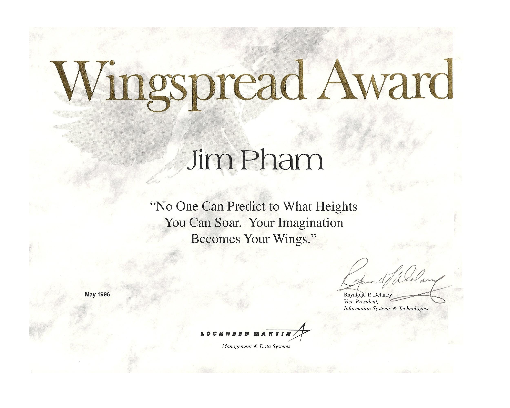

# Award Recognition: Lockheed Martin Wingspread Award

## 🌟 Overview & Significance

The **Wingspread Award** was presented to **Jim Pham** in May 1996 by Lockheed Martin Management & Data Systems. This award recognizes individuals who demonstrate outstanding performance, innovation, and technical leadership within Information Systems & Technologies.

---

---

## 🏆 Award Details

* **Award Title:** Wingspread Award
* **Organization:** Lockheed Martin (Management & Data Systems)
* **Recipient:** Jim Pham
* **Date:** May 1996
* **Award Type:** Executive Certificate of Excellence / Recognition
* **Signatory:** Raymond P. Delaney (Vice President, Information Systems & Technologies)